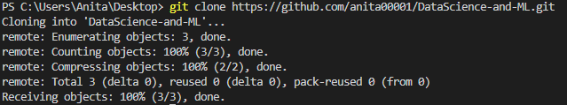
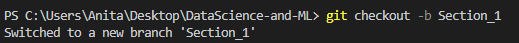
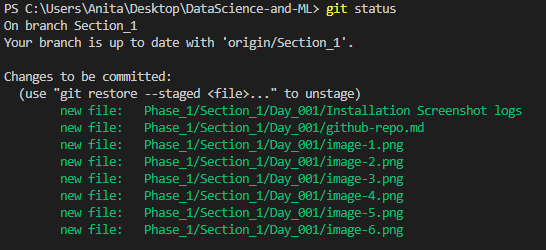
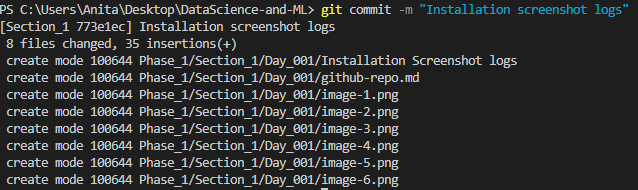
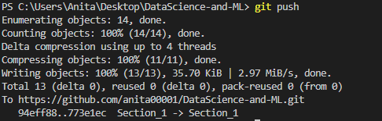
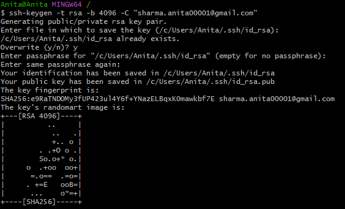
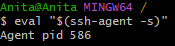
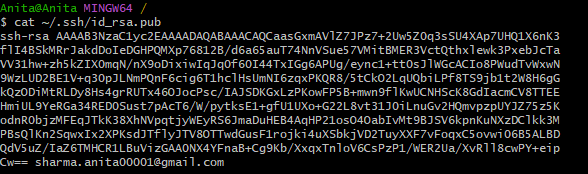
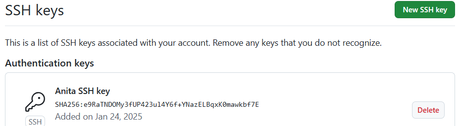

# GitHub 
### 1. Create Repository

### 2. Create Branch

### 3. Add and Commit Change
Add files to the staging

Commit the changes

### 4. Push the changes to the Github

5. Setup SSH key

Generate SSH key

Add the SSH key to the SSH Agent

Add SSH Key to GitHub

